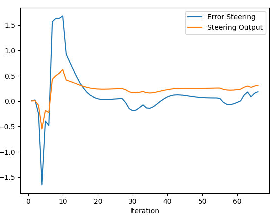

# Control and Trajectory Tracking for Autonomous Vehicle

# Proportional-Integral-Derivative (PID)

## Build the PID controller object
Screenshot after initialization shown below:

## Results

First, for calculating error, I used last point in provided trajectory for calculation. Then I tried non-zero value for P only, non-zero value for P and I, non-zero value for all P, I and D and another set of P, I ,D value.

P = 0.3, I = 0.0, D = 0.0 for both steer and throttle, results shown below:

P = 0.3, I = 0.03, D = 0.0 for both steer and throttle, results shown below:

P = 0.3, I= 0.03, D = 0.2 for both steer and throttle, results shown below:

P_steer = 0.3, I_steer = 0.001, D_steer = 0.3, P_throttle = 0.25, I_throttle = 0.0, D_throttle = 0.12, results shown below:

I'd say from the plots, I can't really tell which setting is better/best, they are kind of similar. But with the last version of setting, the vehicle is able to move for the longest time before a collision happens. I learnt that how difficult to manually tune the parameter to try to optimize, and totally understands how great it would be if an algorithm like Twiddle can be used to find good settings.

Based on some comments I saw in other people posts, I also tried to use closest point in provided trajectory for error calculation. I tried same values used in previous experiments to try to see whether I can get some noticable improvement.

P = 0.3, I = 0.0, D = 0.0 for both steer and throttle, results shown below:

P = 0.3, I = 0.03, D = 0.0 for both steer and throttle, results shown below:

P = 0.3, I= 0.03, D = 0.2 for both steer and throttle, results shown below:

P_steer = 0.3, I_steer = 0.001, D_steer = 0.3, P_throttle = 0.25, I_throttle = 0.0, D_throttle = 0.12, results shown below:

Again from the plots, I can't really tell which setting is better/best, they are kind of similar. And when comparing with the other error calculation setting, I can't see noticeable improvement either. And again with the last version of setting, the vehicle is able to move for the longest time before a collision happens.
